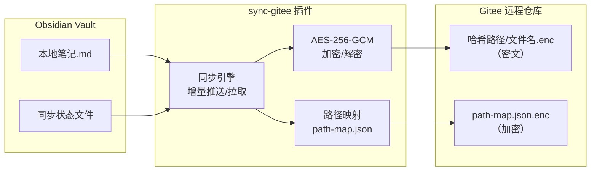

# sync-gitee

> 端到端加密同步 Obsidian 笔记到 Gitee 仓库。本地明文，远程密文。


---

## 目录

- [sync-gitee](#sync-gitee)
  - [目录](#目录)
  - [这是什么？](#这是什么)
  - [功能一览](#功能一览)
  - [快速开始](#快速开始)
    - [安装](#安装)
    - [配置](#配置)
  - [使用](#使用)
  - [架构](#架构)
  - [安全](#安全)
  - [开发](#开发)
    - [环境要求](#环境要求)
    - [命令](#命令)
  - [发布新版本](#发布新版本)
  - [许可证](#许可证)

---

## 这是什么？

sync-gitee 是一个 Obsidian 社区插件，将你的笔记库**端到端加密**后同步到 Gitee 仓库。

与常规云同步方案不同：

- **本地明文，远程密文** — 笔记在本地是明文的，上传到 Gitee 前用 AES-256-GCM 加密，Gitee 上只存密文
- **增量同步** — 只推送有变更的文件，不每次全量上传
- **双向同步** — 支持推送和拉取，多设备间保持笔记一致
- **零成本** — 无需服务器，Gitee 免费仓库即可

---

## 功能一览

| 类别 | 功能 |
|------|------|
| **加密** | AES-256-GCM 端到端加密，PBKDF2 密钥派生，SHA-256 哈希校验 |
| **同步** | 增量推送、增量拉取、删除同步、保存自动推送、定时同步、启动时拉取 |
| **文件** | 二进制文件支持、选择性同步、文件夹级加密密码、重命名检测 |
| **监控** | 状态栏进度条、操作历史、统计仪表盘、日志导出 |
| **运维** | 网络诊断、健康检查、密码变更检测、密码提示 |
| **AI** | 内嵌 MCP 服务器（桌面端），AI 客户端可直接读取 vault |

---

## 快速开始

### 安装

1. 从 [Releases](https://github.com/Weixi138/obsidian-gitee/releases) 下载 `main.js`、`manifest.json`、`styles.css`
2. 复制到 vault 的插件目录：`<vault>/.obsidian/plugins/sync-gitee/`
3. 在 Obsidian 设置中启用插件
4. 填写 Gitee 配置

### 配置

| 设置项 | 说明 |
|--------|------|
| Gitee 用户名 | 仓库所有者的用户名 |
| 仓库名称 | Gitee 仓库名称 |
| 访问令牌 | Gitee 个人访问令牌（需 repo 权限） |
| 加密密码 | 用于端到端加密的密码 |
| 分支 | 推送的目标分支（默认 master） |
| 忽略模式 | 逗号分隔的路径前缀，匹配的文件不会推送 |
| 同步文件夹 | 逗号分隔的文件夹路径，留空则同步所有 |
| 保存后自动推送 | 文件保存后自动加密推送到 Gitee |
| 定时同步间隔 | 设置分钟数，后台自动推送 |

---

## 使用

**推送全部文件** — 点击 Ribbon 图标 → 推送全部文件，或运行命令

**拉取全部文件** — 点击 Ribbon 图标 → 从 Gitee 拉取全部，或运行命令

**选择文件推送** — 点击 Ribbon 图标 → 选择文件推送

**右键推送/拉取** — 在文件上右键 → 推送至 Gitee / 从 Gitee 拉取

**查看历史** — 设置 → 同步历史 / 统计信息

**MCP 连接** — AI 客户端连接 `http://localhost:3100`

---

## 架构



**流程说明**：

1. 本地笔记保存后，插件监听 `modify` 事件
2. 同步引擎读取文件内容，用加密密码进行 AES-256-GCM 加密
3. 本地路径经过哈希处理生成远程路径（如 `a1b2c3d4.enc`）
4. 路径映射关系加密后存入 `path-map.json.enc`
5. 加密后的文件内容通过 Gitee API v5 推送到远程仓库

---

## 安全

| 层次 | 措施 |
|------|------|
| **传输** | 全链路 HTTPS，access_token 仅作为 URL 参数传递（Gitee API 标准方式） |
| **存储** | AES-256-GCM 加密，每个文件使用随机 salt + iv，PBKDF2 100000 轮密钥派生 |
| **路径** | 文件名和目录结构用 SHA-256 哈希，远程无法还原目录结构 |
| **映射** | `path-map.json.enc` 同样使用 AES-256-GCM 加密，不暴露明文路径 |
| **密码** | 密码变更检测，防止旧密码加密的文件无法解密 |
| **令牌** | 所有错误信息中自动过滤 `access_token`，避免泄露 |

---

## 开发

### 环境要求

- Node.js >= 18
- npm >= 9

### 命令

```bash
# 安装依赖
npm install

# 开发模式（监听文件变更）
npm run dev

# 构建
npm run build

# 代码检查
npm run lint
```

---

## 发布新版本

1. 更新 `manifest.json` 中的版本号
2. 更新 `versions.json` 添加版本映射
3. 运行 `npm run build` 构建
4. 提交并推送代码
5. 创建 GitHub Release，上传 `main.js`、`manifest.json`、`styles.css`

---

## 许可证

[MIT](./LICENSE)