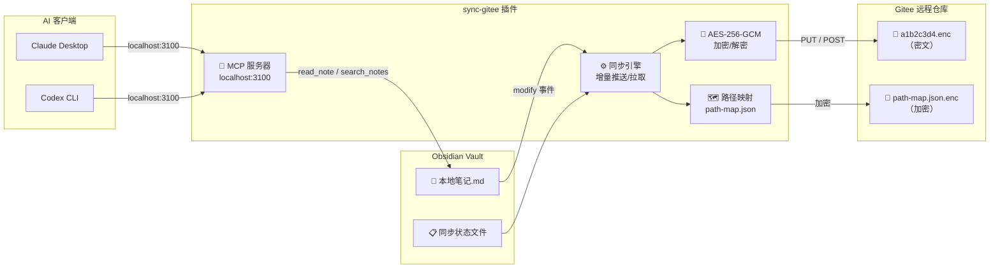

# sync-gitee

> 端到端加密同步 Obsidian 笔记到 Gitee 仓库。本地明文，远程密文。


[](https://github.com/Weixi138/obsidian-gitee/releases)
[](https://github.com/Weixi138/obsidian-gitee/stargazers)
[](./LICENSE)
[]()

---

[关于](#关于) · [功能](#功能) · [快速开始](#快速开始) · [使用](#使用) · [架构](#架构) · [安全](#安全) · [开发](#开发) · [许可证](#许可证)

---

## 关于

sync-gitee 是一个 Obsidian 插件，将你的笔记库**端到端加密**后同步到 Gitee 仓库。

**为什么需要它？**

现有的 Obsidian 同步方案（Obsidian Sync、iCloud、Git 等）要么是付费的，要么把明文笔记上传到第三方服务器。sync-gitee 让你用免费的 Gitee 仓库做存储，且上传前所有内容都用 AES-256-GCM 加密，Gitee 上只存密文。

```
用户写入笔记 → 插件监听修改 → AES-256-GCM 加密 → Gitee API → 远程仓库(.enc文件)
```

**核心设计原则：**

- **本地明文，远程密文** — 你的笔记你掌控，Gitee 只存加密后的二进制
- **零成本** — 无需服务器，Gitee 免费仓库即可
- **全平台** — 桌面端和移动端（iOS/Android）均可使用

---

## 功能

### 核心能力

| 能力 | 说明 |
|------|------|
| **端到端加密** | AES-256-GCM + PBKDF2 100000 轮，每个文件独立 salt/iv |
| **增量推送** | 只推送有变更的文件，基于 SHA-256 哈希比较 |
| **增量拉取** | 从 Gitee 拉取远程变更到本地，基于 remoteSha 比较 |
| **删除同步** | 本地删除文件后，推送时自动删除远程对应文件 |
| **二进制文件** | 支持图片、PDF、视频等任意文件类型 |
| **文件夹密码** | 不同文件夹可设置不同加密密码 |

### 同步体验

| 功能 | 说明 |
|------|------|
| **保存自动推送** | 文件保存后 2 秒防抖自动加密推送 |
| **启动时拉取** | Obsidian 启动时自动拉取最新文件 |
| **定时同步** | 设置间隔后台自动推送 |
| **选择性同步** | 文件夹级别开关，只同步勾选的文件夹 |
| **重命名检测** | 检测文件重命名，自动更新路径映射 |

### 监控与运维

| 功能 | 说明 |
|------|------|
| **状态栏进度条** | 显示同步状态和上次同步时间 |
| **操作历史** | 记录每次同步的详情（推送/拉取/错误） |
| **统计仪表盘** | 推送次数、拉取次数、文件数统计 |
| **日志导出** | 导出同步历史为 Markdown 文件 |
| **网络诊断** | 一键测试 DNS、API 连通性、令牌有效性 |
| **健康检查** | 验证远程文件完整性和密码匹配 |
| **密码提示** | 设置密码提示帮助记忆 |
| **自动检查更新** | 启动时自动检查 GitHub 新版本，发现更新时弹窗显示更新日志 |
| **手动检查更新** | 设置页「检查更新」按钮，随时检测最新版本 |

### AI 集成

| 功能 | 说明 |
|------|------|
| **内嵌 MCP 服务器** | 启动本地 MCP 服务器（端口 3100），AI 客户端可直接读取 vault |
| **list_notes** | 列出 vault 中所有笔记 |
| **read_note** | 按路径读取笔记内容 |
| **search_notes** | 按关键词搜索笔记内容 |

---

## 快速开始

### 前置要求

- Obsidian v1.0.0+
- Gitee 账号 + 个人访问令牌（需 repo 权限）

### 安装

| 步骤 | 操作 |
|------|------|
| 1 | 从 [Releases](https://github.com/Weixi138/obsidian-gitee/releases) 下载 `main.js`、`manifest.json`、`styles.css` |
| 2 | 复制到 vault 目录：`<vault>/.obsidian/plugins/sync-gitee/` |
| 3 | 在 Obsidian 设置 → 社区插件中启用 sync-gitee |
| 4 | 填写 Gitee 配置信息和加密密码 |

### 配置项

| 设置 | 说明 | 默认值 |
|------|------|--------|
| Gitee 用户名 | 仓库所有者的用户名 | — |
| 仓库名称 | Gitee 仓库名称 | — |
| 访问令牌 | Gitee 个人访问令牌 | — |
| 加密密码 | 端到端加密密码 | — |
| 分支 | 推送目标分支 | master |
| 忽略模式 | 逗号分隔的路径前缀 | .obsidian, .git |
| 同步文件夹 | 逗号分隔，留空同步所有 | — |
| 最大文件大小 | 超过此大小的文件被跳过 | 50 MB |
| 保存后自动推送 | 开启后文件保存自动推送 | 关闭 |
| 启动时自动拉取 | 开启后启动时自动拉取 | 关闭 |
| 定时同步间隔 | 分钟数，0 不启用 | 0 |

---

## 使用

### 推荐工作流

| 场景 | 操作 |
|------|------|
| **日常修改文件** | 设置中开启「保存后自动推送」，改完即同步，零操作 |
| **删除/剪切文件** | 删除后运行一次「推送全部文件」，远程自动同步删除 |
| **清空远程仓库** | 直接运行「推送全部文件」，插件自动检测远程文件缺失并重新上传 |
| **多设备同步** | 在新设备上运行「从 Gitee 拉取全部」，将远程变更拉到本地 |

### 命令

| 操作 | 方式 |
|------|------|
| **推送全部文件** | Ribbon 图标 → 推送全部文件 / 命令面板 |
| **拉取全部文件** | Ribbon 图标 → 从 Gitee 拉取全部 / 命令面板 |
| **选择文件推送** | Ribbon 图标 → 选择文件推送 |
| **右键推送** | 文件上右键 → 推送至 Gitee |
| **右键拉取** | 文件上右键 → 从 Gitee 拉取 |

### 查看信息

| 操作 | 路径 |
|------|------|
| **同步历史** | 设置 → 同步历史 |
| **统计信息** | 设置 → 统计信息 |
| **网络诊断** | 设置 → 网络诊断 |
| **健康检查** | 设置 → 健康检查 |
| **MCP 连接** | AI 客户端连接 `http://localhost:3100` |

---

## 架构



### 关键文件

| 文件 | 用途 |
|------|------|
| `sync-state.json` | 本地同步状态（localHash / remoteSha 等） |
| `path-map.json.enc` | 远程路径 → 本地路径映射（AES-256-GCM 加密） |
| `sync-history.json` | 同步操作历史记录 |

### 仓库布局

```
sync-gitee/
├── src/
│   ├── main.ts                 # 插件入口，生命周期
│   ├── settings.ts             # 设置界面
│   ├── types.ts                # 类型定义
│   ├── crypto.ts               # AES-256-GCM 加解密
│   ├── password-manager.ts     # 密码管理
│   ├── gitee/
│   │   └── client.ts           # Gitee API v5 客户端
│   ├── sync/
│   │   ├── engine.ts           # 同步引擎
│   │   ├── state.ts            # 状态持久化
│   │   ├── history.ts          # 操作历史
│   │   └── mcp-server.ts       # MCP 服务器
│   ├── utils/
│   │   ├── path.ts             # 路径转换
│   │   ├── file-utils.ts       # 文件读写
│   │   └── diagnostics.ts      # 网络诊断
│   └── ui/
│       └── history-view.ts     # 历史弹窗
├── main.js                     # 构建产物
├── manifest.json               # 插件清单
├── styles.css                  # 样式
├── package.json
├── tsconfig.json
└── esbuild.config.mjs
```

---

## 安全

| 层次 | 措施 |
|------|------|
| **加密算法** | AES-256-GCM，认证加密模式，同时保证机密性和完整性 |
| **密钥派生** | PBKDF2-HMAC-SHA256，100000 轮迭代，每文件独立随机 salt |
| **初始化向量** | 每个文件独立 12 字节随机 IV |
| **数据格式** | `GSE1:salt(16)+iv(12)+encryptedData+authTag`，base64 编码 |
| **路径保护** | 文件名和目录用 SHA-256(password:segment) 前 16 位哈希 |
| **路径映射** | `path-map.json.enc` 同样用 AES-256-GCM 加密 |
| **令牌保护** | 错误信息中自动过滤 `access_token`，避免泄露 |
| **密码变更检测** | 检测密码哈希，变更时阻止同步，防止数据无法解密 |

### 加密格式

```
原始数据 → AES-256-GCM 加密 → salt(16B) + iv(12B) + encryptedData
                                                            ↓
                                           base64 编码 → "GSE1:base64..."
```

---

## 开发

### 环境要求

- Node.js >= 18
- npm >= 9

### 命令

| 命令 | 说明 |
|------|------|
| `npm install` | 安装依赖 |
| `npm run dev` | 开发模式（监听文件变更） |
| `npm run build` | 构建（tsc 检查 + esbuild 打包） |
| `npm run lint` | ESLint 代码检查 |

### 发布新版本

1. 更新 `manifest.json` 中的版本号
2. 更新 `versions.json` 添加版本映射
3. 运行 `npm run build` 构建
4. 提交并推送代码
5. 创建 GitHub Release，上传 `main.js`、`manifest.json`、`styles.css`

---

## 许可证

[MIT](./LICENSE)

---

[回到顶部](#sync-gitee)